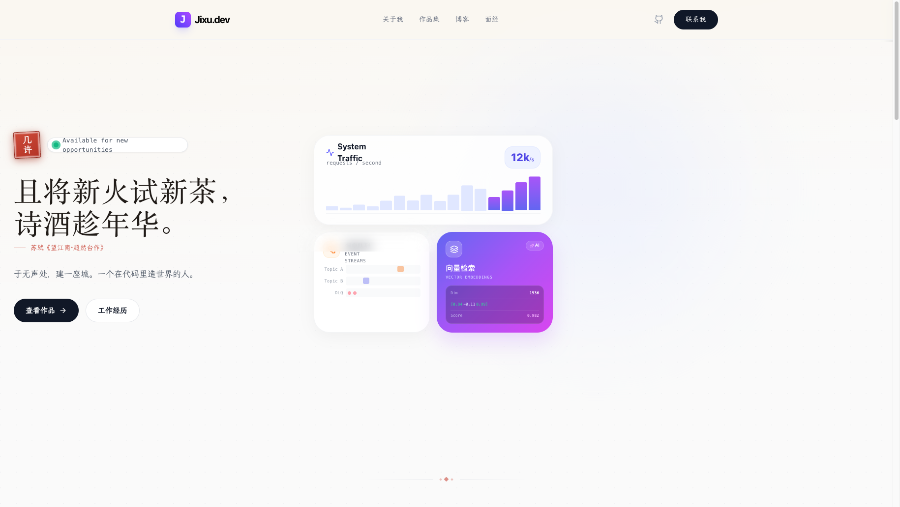
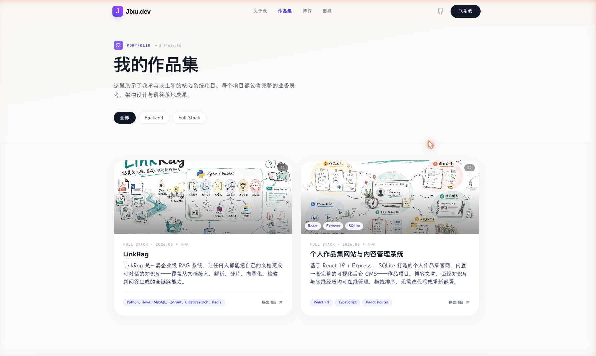
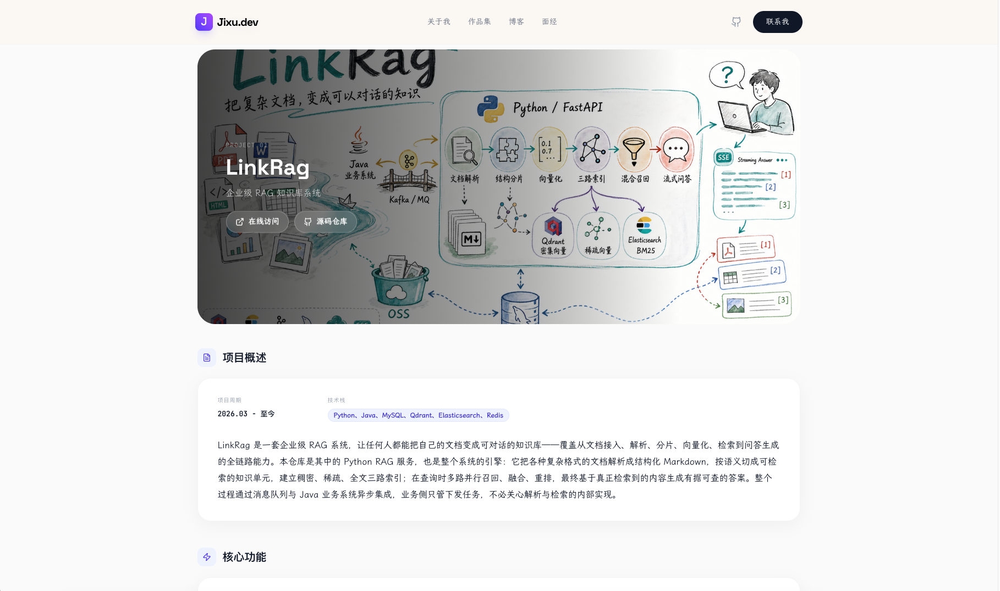
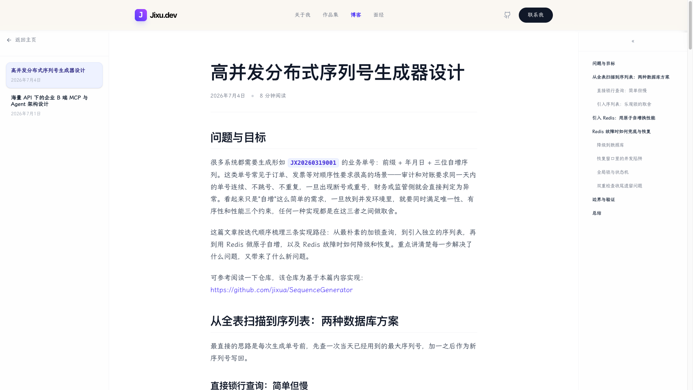
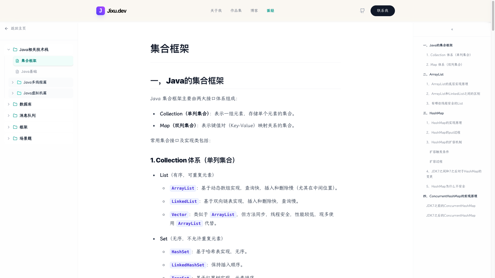
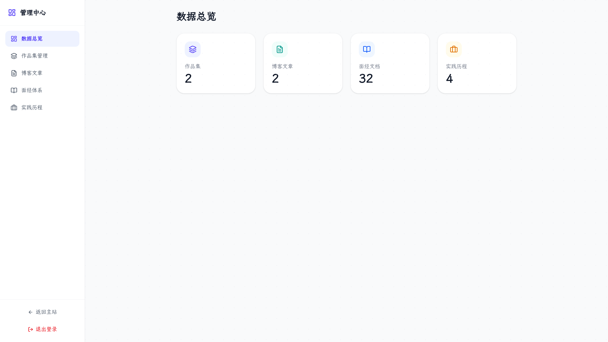
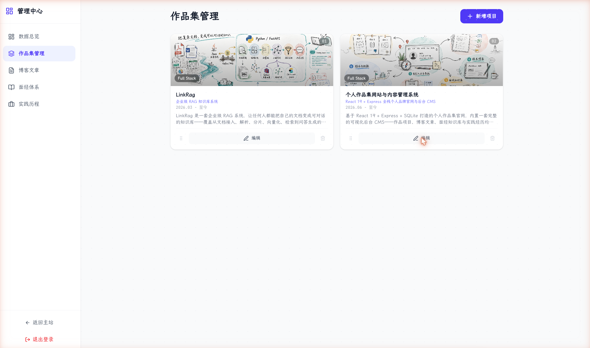
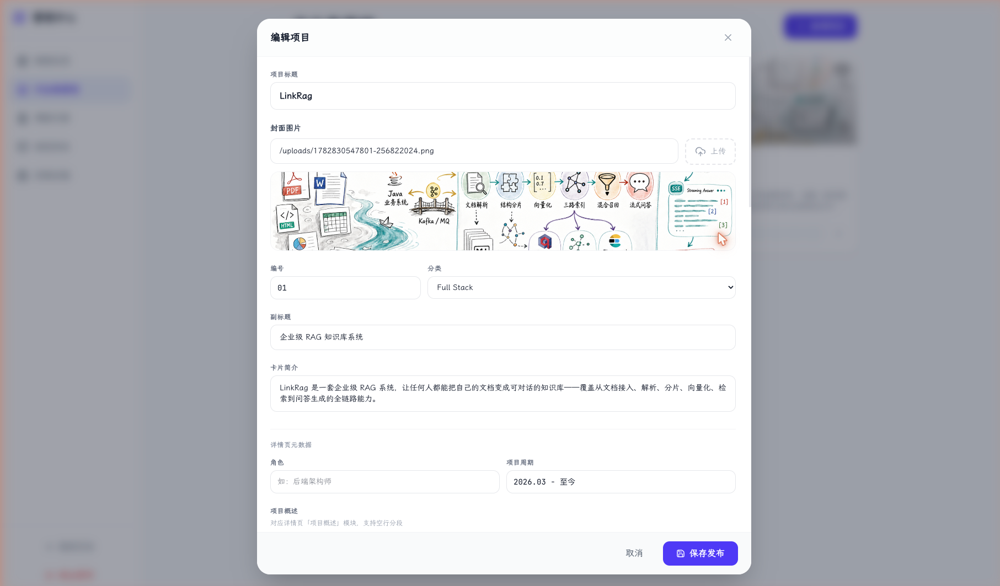

# Personal Portfolio & CMS

一个基于 React 19、Express 和 SQLite 的个人作品集网站与内容管理系统。它对外是个人官网，用来展示作品、博客、面经知识库和实践经历；对内是一套轻量 CMS，让内容更新变成后台表单操作，而不是改代码、重新构建、重新部署。

## 功能概览

- 个人首页：展示个人介绍、精选作品、实践经历和文章预览。
- 作品集：支持项目卡片、分类筛选、项目详情页、技术栈、项目功能拆解和 Markdown 详情内容。
- 博客：支持 Markdown 正文、长文目录、代码高亮、数学公式、Mermaid 图和富文本渲染。
- 面经知识库：支持树形分类、文件夹/文档层级、拖拽排序和 Markdown 笔记。
- 实践经历：以结构化方式维护公司、角色、时间、成果和技术栈。
- 后台管理：`/admin` 登录后管理项目、博客、面经和经历，支持新增、编辑、删除、拖拽排序。
- 图片上传：支持本地上传目录，也支持阿里云 OSS；当前线上配置已接入 OSS。
- 持久化：使用 SQLite 单文件数据库，适合个人站点和低资源服务器。

## 项目截图

以下截图来自 SQLite 中「个人作品集网站与内容管理系统」项目详情记录。

















## 技术栈

- 前端：React 19、TypeScript、React Router、Tailwind CSS、motion、lucide-react
- Markdown：react-markdown、remark-gfm、remark-math、rehype-katex、rehype-sanitize、Mermaid
- 后端：Express、better-sqlite3、JWT、bcryptjs、Multer
- 存储：SQLite、本地 uploads、阿里云 OSS
- 构建：Vite、esbuild、tsx
- 部署：Node.js + systemd + Nginx

## 项目结构

```text
.
├── server.ts                 # Express API、SQLite 初始化、上传与生产静态服务
├── src/
│   ├── App.tsx               # 路由入口
│   ├── context/DataContext.tsx
│   ├── components/           # 首页和通用组件
│   ├── pages/                # 作品、博客、后台、详情页
│   ├── lib/markdown.ts       # Markdown 相关工具
│   └── data.ts               # 类型定义和静态兜底数据
├── data/
│   └── database.sqlite       # SQLite 数据库
├── uploads/                  # 本地上传文件和缩略图
├── public/                   # 静态资源
├── scripts/
│   ├── deploy-server.sh      # 发布到服务器
│   └── migrate-images-to-oss.mjs
├── package.json
└── vite.config.ts
```

## 本地运行

要求 Node.js 22 或兼容版本。

```bash
npm install
npm run dev
```

默认开发服务由 `tsx server.ts` 启动。Express 会在开发环境挂载 Vite middleware，所以前端页面和 API 使用同一个服务进程。

## 常用命令

```bash
npm run dev      # 本地开发
npm run build    # 构建前端和 server.cjs
npm run start    # 运行生产构建
npm run lint     # TypeScript 类型检查
npm run clean    # 清理构建产物
```

## 环境变量

基础配置：

```env
NODE_ENV=production
PORT=31001
JWT_SECRET=replace-with-a-random-secret
ADMIN_EMAIL=admin@example.com
ADMIN_PASSWORD=change-me
```

阿里云 OSS 配置：

```env
ALI_OSS_REGION=oss-cn-shanghai
ALI_OSS_BUCKET=qingluo-blog-oss
ALI_OSS_ENDPOINT=https://oss-cn-shanghai.aliyuncs.com
ALI_OSS_PREFIX=jixu/portfolio/uploads
ALI_OSS_MIGRATE_PREFIX=jixu/portfolio
ALI_OSS_PUBLIC_BASE_URL=https://qingluo-blog-oss.oss-cn-shanghai.aliyuncs.com
ALI_OSS_ACCESS_KEY_ID=
ALI_OSS_ACCESS_KEY_SECRET=
```

如果 OSS 环境变量完整，后台上传会直接写入 OSS，并返回公开访问 URL。否则会退回本地 `uploads/` 目录。

## 数据模型

核心数据保存在 `data/database.sqlite`：

- `users`：后台管理员账号
- `projects`：作品项目、封面、缩略图、技术栈、功能点、排序
- `posts`：博客文章、分类、摘要、正文、排序
- `docs`：面经知识库树形节点
- `experiences`：实践经历和技术栈

服务启动时会自动执行轻量迁移，缺少字段会通过 `ALTER TABLE` 补齐。

## 图片与 OSS

当前图片组织方式：

```text
jixu/portfolio/projects/covers/original/  # 项目封面原图
jixu/portfolio/projects/covers/thumbs/    # 项目封面缩略图
jixu/portfolio/uploads/                   # 普通上传图片
jixu/portfolio/public/                    # public 静态图片
```

列表页优先使用 `thumbnailUrl`，详情页保留 `imageUrl` 原图。这样项目卡片不再加载 1-2MB 原始 PNG，而是加载几十 KB 的 WebP 缩略图。

迁移现有图片到 OSS：

```bash
node scripts/migrate-images-to-oss.mjs --dry-run
node scripts/migrate-images-to-oss.mjs
```

迁移脚本会上传 `uploads/` 和 `public/` 中的图片，并更新 SQLite 中的图片引用。执行前建议备份数据库：

```bash
cp data/database.sqlite data/database.sqlite.before-oss-migration
```

## 生产部署

当前推荐方式是 Node.js + systemd + Nginx，适合 2C2G 这种资源较小的服务器。

部署目录约定：

```text
/opt/personal-portfolio/
├── current -> releases/<timestamp>
├── releases/
└── shared/
    ├── data/
    ├── uploads/
    └── .env
```

本地更新后发布：

```bash
./scripts/deploy-server.sh
```

脚本会执行：

1. 本地 `npm run build`
2. 同步 `dist`、`package.json`、`package-lock.json`
3. 在服务器安装生产依赖
4. 切换 `current` symlink
5. 重启 `personal-portfolio.service`
6. reload Nginx
7. 保留最近 5 个 release

## Nginx 代理

生产环境由 Nginx 接收 `www.jixu.ink` 请求，并反代到本机 Node 服务：

```nginx
server {
    listen 80;
    server_name www.jixu.ink;

    location / {
        proxy_pass http://127.0.0.1:31001;
    }
}
```

静态资源和本地上传目录可由 Nginx 直接服务并加缓存。接入 OSS 后，大部分图片流量会从 OSS 走，不再占用应用服务器带宽。

## 后台管理

后台入口：

```text
/admin
```

后台支持：

- 管理项目：封面、缩略图、简介、角色、周期、技术栈、功能点、Markdown 详情
- 管理博客：分类、摘要、正文、Markdown 导入和图片上传
- 管理面经：树状文件夹、文档节点、拖拽排序
- 管理经历：公司、角色、时间、成果、技术栈

注册接口已关闭，只允许预置管理员登录。管理员账号由 `ADMIN_EMAIL` 和 `ADMIN_PASSWORD` 控制。

## 设计取向

这个项目不是单纯的静态作品展示页，而是一个面向长期维护的个人内容系统。核心目标是：

- 内容数据库驱动，避免每次更新都改代码
- 后台编辑体验足够直接，适合一个人长期维护
- 前台展示克制清晰，优先表达项目和技术沉淀
- 部署方式轻量，适合低配置服务器
- 图片资源外置到 OSS，降低服务器带宽压力

## 安全建议

- 不要提交真实 `.env` 和 AccessKey。
- OSS AccessKey 建议使用 RAM 子账号，并只授予当前 Bucket 所需权限。
- 如果 AccessKey 泄露或出现在聊天记录中，应立即轮换。
- 生产环境必须设置强 `JWT_SECRET` 和强后台密码。
